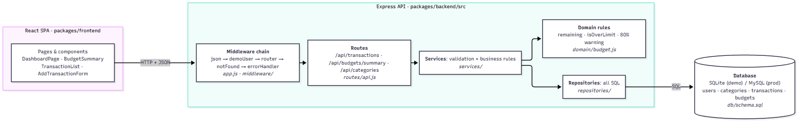

# LedgerLogic architecture (TE4)



Source: [`layers.mmd`](layers.mmd). Re-render after editing:

```bash
npx -y @mermaid-js/mermaid-cli -i docs/architecture/layers.mmd -o docs/architecture/layers.png -b white -s 2
```

## Layers

Each layer only talks to the one below it. Requests flow down; JSON flows back up.

| Layer            | Responsibility                                                                                       | Lives in                                         | Knows about                |
| ---------------- | ---------------------------------------------------------------------------------------------------- | ------------------------------------------------ | -------------------------- |
| **Client**       | Renders the dashboard and the add-transaction form; calls the API with `fetch('/api/...')`           | `packages/frontend/`                             | The REST API only          |
| **Middleware**   | Cross-cutting concerns for every request: JSON parsing, which user is calling, 404s, error responses | `packages/backend/src/app.js`, `src/middleware/` | Express request/response   |
| **Routes**       | Map an HTTP method + URL to a service call; parse query/body; choose the status code                 | `src/routes/api.js`                              | Services                   |
| **Services**     | Validate input and apply business rules (e.g. a category must match the transaction type)            | `src/services/`                                  | Repositories, domain rules |
| **Domain rules** | Pure functions for budget math: remaining, over limit, 80% warning                                   | `src/domain/budget.js`                           | Nothing (no I/O)           |
| **Repositories** | All SQL. Turn rows into plain objects                                                                | `src/repositories/`                              | The database               |
| **Database**     | Persistent storage for users, categories, transactions, budgets                                      | `src/db/schema.sql`                              | —                          |

## Why layers

- **Testable:** `test/api.test.js` runs the whole stack against an in-memory database, because `createApp(db)` takes the database as a parameter.
- **Swappable storage:** only `src/repositories/` and `src/db/` contain SQL. Moving from SQLite to MySQL changes those two folders, not the routes or services.
- **One place per rule:** the 80% warning (US-09) is defined once in `domain/budget.js`, so the API and any future report agree.

## Component wiring

`createApp(db)` in [`src/app.js`](../../packages/backend/src/app.js) is the composition root: it builds the repositories, hands them to the services, and hands the services to the router. Nothing else creates its own dependencies.

```
createApp(db)
├── TransactionRepository(db) ─┐
├── CategoryRepository(db) ────┼─> TransactionService ─┐
├── BudgetRepository(db) ──────┴─> BudgetService ──────┴─> apiRouter
└── middleware: json → demoUser → apiRouter → notFound → errorHandler
```

## Request walk-through: add an expense

1. The form sends `POST /api/transactions` with `{ amount, type, categoryId, date, note }`.
2. `express.json()` parses the body; `demoUser` sets `req.userId`.
3. `routes/api.js` calls `transactionService.create(req.userId, req.body)`.
4. The service validates every field, checks that the category belongs to the user and matches the type, and converts dollars to cents.
   - If anything is invalid, it throws `HttpError(400, …, details)` and `errorHandler` returns the list of problems.
5. `transactionRepository.create(...)` inserts the row and returns it joined with its category name.
6. The route responds `201` with the new transaction. The client then re-fetches `/api/budgets/summary` so totals and budget bars update.

The full sequence diagram for this flow is #27.
