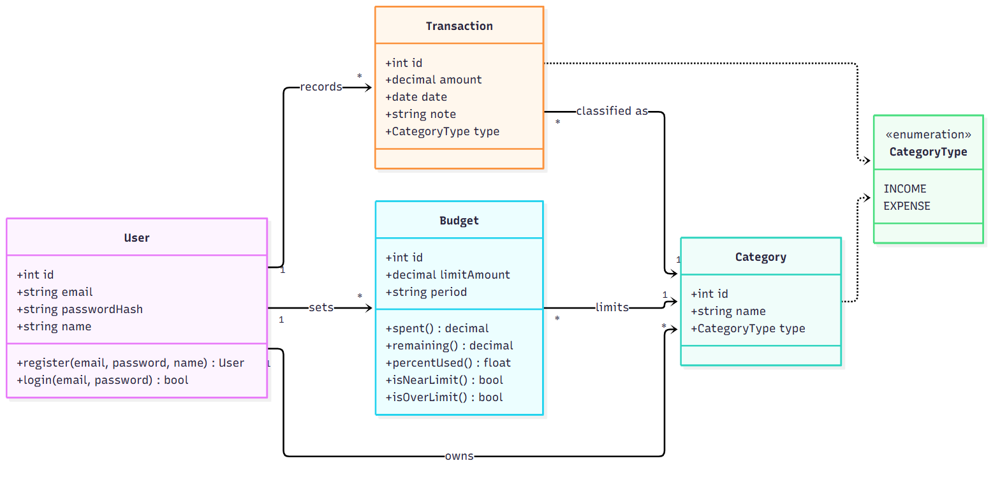
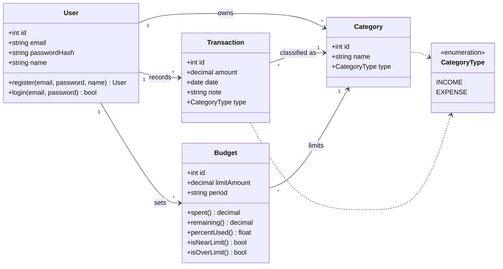

# LedgerLogic domain model (TE3)



Source: [`class-diagram.mmd`](class-diagram.mmd). Re-render the PNG after editing it:

```bash
npx -y @mermaid-js/mermaid-cli -i docs/uml/class-diagram.mmd -o docs/uml/class-diagram.png -b white -s 2
```



## Classes

| Class            | Responsibility                                                                                                                                                                                               |
| ---------------- | ------------------------------------------------------------------------------------------------------------------------------------------------------------------------------------------------------------ |
| **User**         | A registered student. Owns all of their data, so records stay private (US-07).                                                                                                                               |
| **Category**     | A user-defined bucket such as "Groceries" or "Part-time Job". `type` says whether it holds income or expenses.                                                                                               |
| **Transaction**  | One income or expense entry with amount, date, category, and note (US-01, US-02, US-03).                                                                                                                     |
| **Budget**       | A monthly spending limit for one expense category. `period` is a month (`YYYY-MM`). It derives how much has been spent, what remains, and whether the user is near (≥ 80%) or over the limit (US-08, US-09). |
| **CategoryType** | Enumeration: `INCOME` or `EXPENSE`.                                                                                                                                                                          |

## Design notes

- **Money** is `decimal` in the model and stored as integer cents in the database, which avoids floating-point rounding errors.
- **Budget is per category per month.** A user has at most one budget for a given category and period.
- **Dashboard totals are derived, not stored.** Total income, total expenses, and remaining balance (US-04) and the spending-by-category chart (US-05) are computed from Transactions for a period, so no extra class is needed.
- **Filtering (US-06)** is a query over Transactions by category and date range, not a class.
- **Not modeled:** a SavingsGoal class was considered but dropped, because no TE2 user story requires it. It can be added later if the team writes a story for it. Admin features are also not modeled, since SRS §2.2 has no admin stories yet.

See [`traceability.md`](traceability.md) for how each user story maps to these classes.
